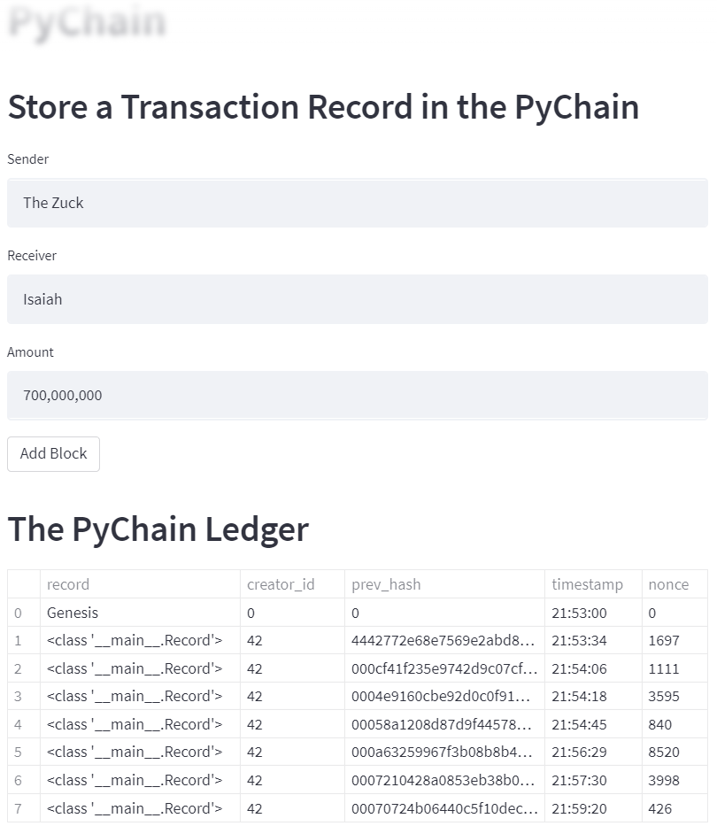
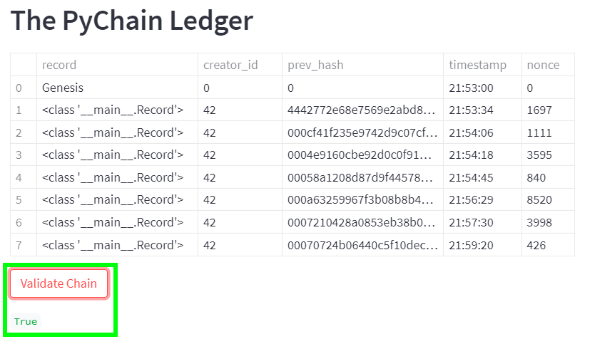
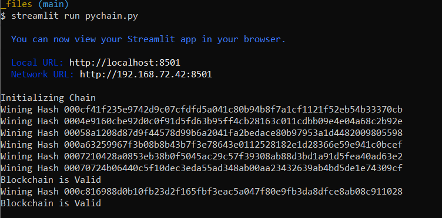

# Blockchain_Ledger_System

This Python app is meant to demonstrate how a blockchain can be used to create a ledger system that allows two parties, whether they be financial institutions or individuals, to conduct financial transactions between one another, as well as how the integrity of the data of said ledger system is verified.
In the application, there is a sender, receiver, and amount of money which gets entered by the user in a user-friendly interface, and gets added together as a block in the demonstrated blockchain.

---

## Technologies

### Libraries:
* Pandas
* hashlib
* datetime
* Any and List from typing
* dataclass from dataclasses
* Streamlit

The language of this application is Python on the Anaconda developement environment, used in Visual Studio Code. The libraries used that come with Anaconda Python are all listed besides Streamlit. To use Streamlit, it must be installed.

---

## Installation Guide

To install Streamlit, enter `pip install streamlit` to the terminal. After, enter `conda list streamlit` to confirm its installation.

---

## Usage

#### Blocks added to blockchain:

#### Validity of blockchain:

#### Validity of blockchain shown in bash:

After entering `streamlit run pychain.py` to the terminal, you'll have access to the application via a web interface. There one can follow the prompts to use the app and get a first hand demonstration.

---

## Contributor

Isaiah T Tensae